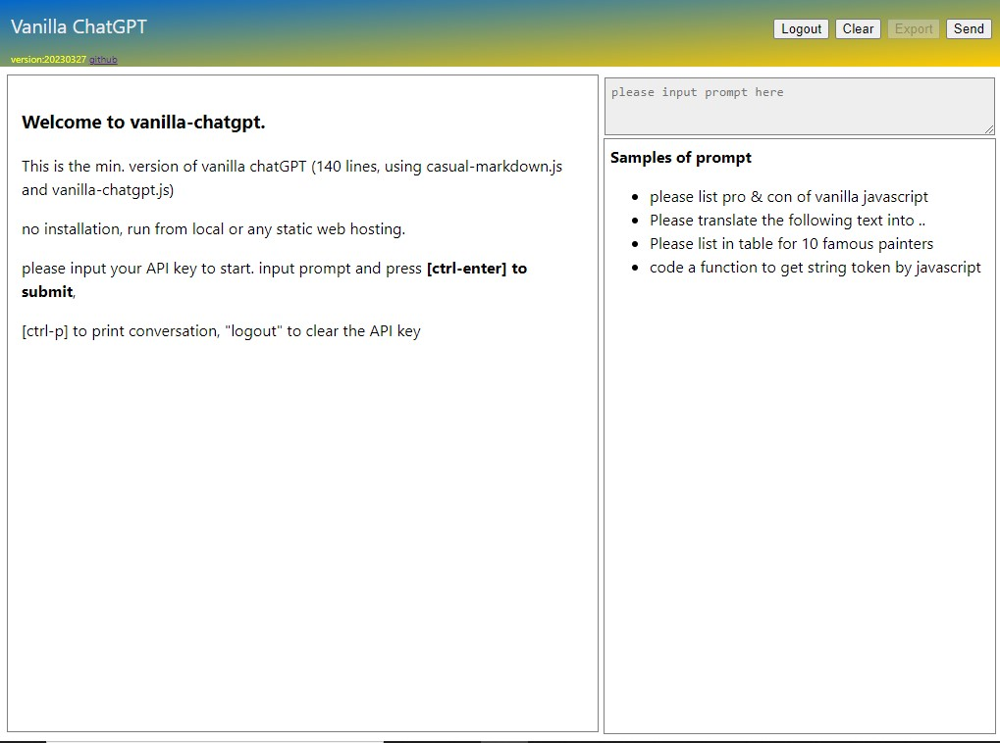

# vanilla-chatgpt

A minimal ChatGPT client by vanilla javascript, run from local or any static web host

For example, 

* https://raw.githack.com/casualwriter/vanilla-chatgpt/main/source/index.html
* https://raw.githack.com/casualwriter/vanilla-chatgpt/main/source/vanilla-chatgpt.html

### Features

* no dependence in vanilla javascript
* no installation, run from local or web
* simple with reusable library
* print friendly for conversation
* responsive for mobile

### How to run and use

Fork [this repo](https://github.com/casualwriter/vanilla-chatgpt), 
or just click on above link, or download and run locally.

1. ``input OPEN_API_KEY`` when load the page first time. API key will save to browser local storage.
1. ``Prompt Hints`` shows in right-corner, click to select it.
1. ``Input prompt`` and click `[Send]` button or press `ctrl-enter`
1. ``List of prompts`` will show in right corner, click to jump to prompt section.
1. Press [ctrl-p] to `print conversation`
1. Click on [clear] button, to `clear conversation history`
1. Click on **[logout]** button, to `clear OPEN_API_KEY` from local storage.

### Files

This repository include 2 version of vanilla-chatGPT, and its javascript libary

1. `index.html` is the all-in-one version of vanilla-chatGPT. no dependence in vanilla javascript.
2. `vanilla-chatgpt.html` is the minimum version using casual-markdown.js and vanilla-chatgpt.js.
3. `casual-markdown@0.91.js`  // [casual-markdown 0.91](https://raw.githack.com/casualwriter/casual-markdown), for chatGPT markdown
4. `vanilla-chatgpt.js`  //  js library for vanilla-chatgpt, reusable for your chatGPT client.

### Credit

Inspired by the some self-host solution

* https://github.com/yuezk/chatgpt-mirror, mirror of ChatGPT (node.js, self-host)
* https://github.com/dirk1983/chatgpt, a simple self-host solution (php)

(2023/03/27, v0.50, casualwriter, MIT license)
